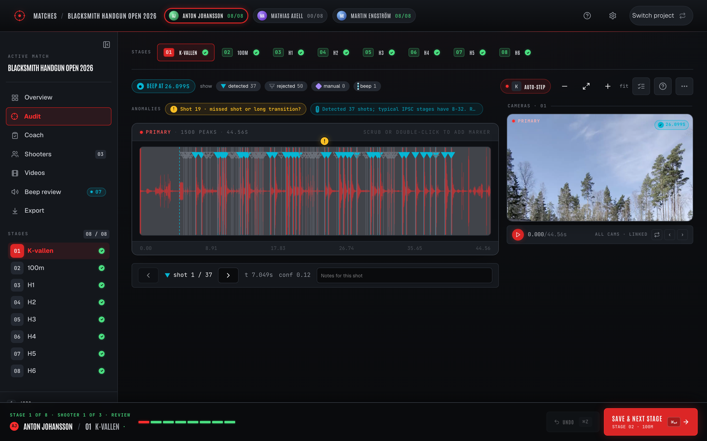
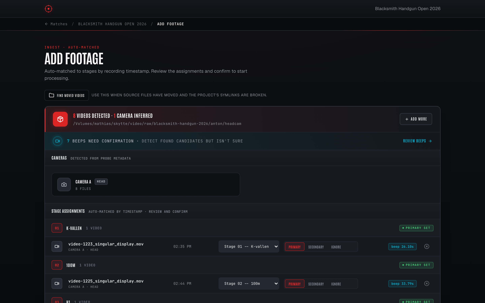
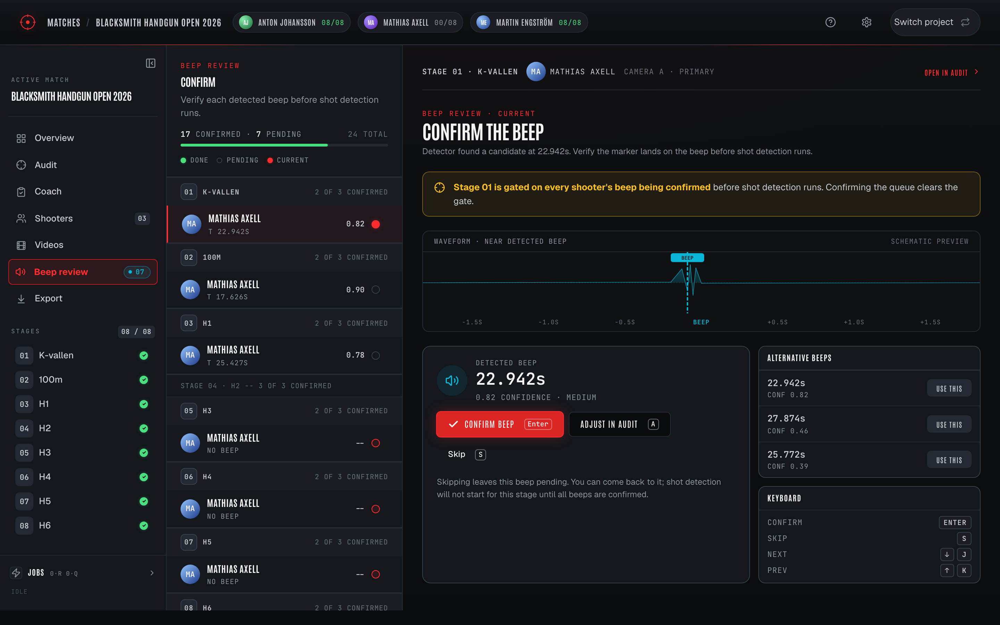
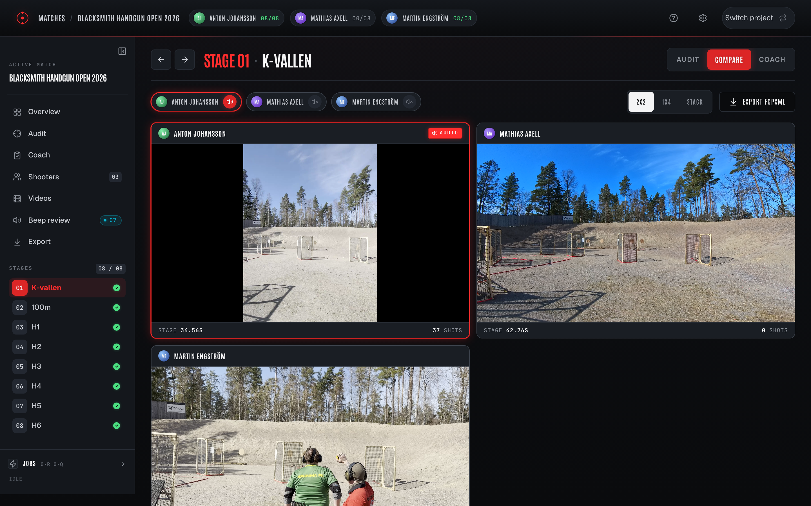
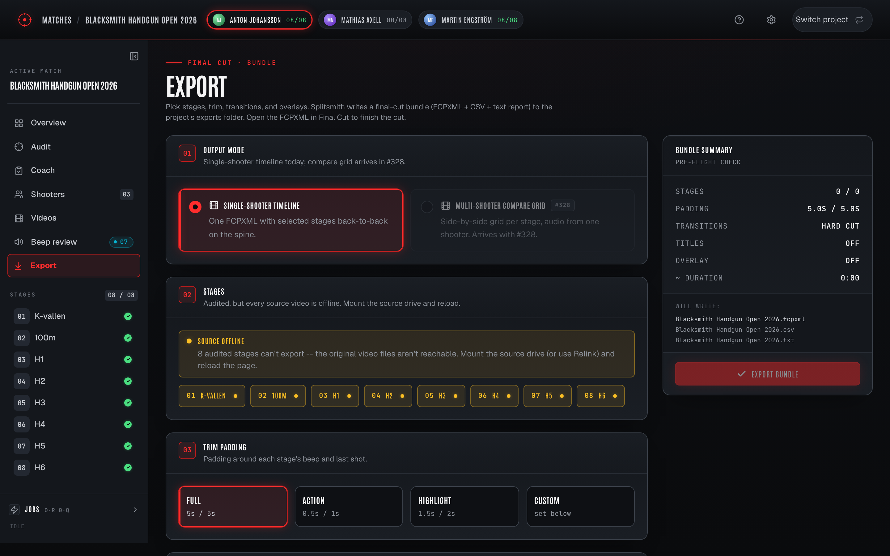

# splitsmith

Extract per-shot split times from head-mounted camera footage of IPSC matches and generate Final Cut Pro timelines with per-shot markers.



Shot timers like the CED7000 give you splits during practice, but at matches you can't carry one. Head-mounted cameras (Insta360 Go 3S in this case) capture audio that contains all the shot information -- this tool extracts it and turns it into actionable training data.

**Inputs:** raw MP4s from a head-mounted cam, stage time data from SSI Scoreboard.
**Outputs (per stage):** lossless trim around the start beep, splits CSV, FCPXML with frame-aligned markers, anomaly report.

## What it looks like

| | |
|---|---|
|  | **Ingest.** Drop a folder of GoPro clips; the engine auto-matches them to stages by file timestamp. |
|  | **Beep review.** Auto-snap to the start beep on each stage; low-confidence detections land in a HITL queue. |
|  | **Audit.** Waveform + per-shot markers from the 3-voter ensemble. Click a marker to inspect votes; drag to fine-tune. |
|  | **Compare.** Multi-shooter grid, all beep-aligned to t=0. Audio from one shooter, video tiles for everyone else. |
|  | **Export.** Per-stage or whole-match FCPXML. Open in Final Cut Pro, M / Shift+M to navigate markers. |

> Screenshots regenerate from a live `splitsmith ui` via `scripts/capture_screenshots.py`. See [issue tracking the local run](#regenerating-screenshots) below.

## Quickstart

The repo ships a real Stage 3 audio sample (Tallmilan 2026, 14.74s, 14 audited shots) at `tests/fixtures/stage_sample.wav` plus its companion source MP4 (gitignored; bring your own video or use any IPSC head-cam clip). Full end-to-end run:

```bash
git clone https://github.com/mandakan/splitsmith.git
cd splitsmith
uv sync
(cd src/splitsmith/ui_static && pnpm install && pnpm build)

uv run splitsmith single \
    --video path/to/your_stage.mp4 \
    --time 14.74 \
    --output ./demo_analysis \
    --stage-name "Per told me to do it" \
    --stage-number 3

ls -la ./demo_analysis/
cat ./demo_analysis/stage3_per-told-me-to-do-it_report.txt
```

Expected on the bundled sample: beep at ~19.87s, ~39 shot candidates (audited ground truth is 14; the rest are echoes / neighbouring bays), anomaly report flags the high shot count and the 928 ms overshoot vs official stage time. See `docs/COMMANDS.md` for the cull workflow.

For the full ingest -> audit -> export workflow with persistent project state, use the UI:

```bash
uv run splitsmith ui --project ~/matches/your-match
```

## The workflow

1. **Ingest** -- point at a folder of raw cam files; `splitsmith ui` auto-matches them to scoreboard stages by file timestamp.
2. **Beep review** -- the detector finds the start beep on each stage; anything below the auto-trust threshold lands in a HITL queue.
3. **Audit** -- the 3-voter ensemble (envelope onsets + CLAP prompts + GBDT over hand-crafted + PANN features) emits shot times; review the waveform and drag / drop markers to fix outliers.
4. **Export** -- generate a per-stage FCPXML (markers per shot) or a multi-shooter Compare FCPXML (beep-aligned grid). Splits CSV ships alongside for the cull workflow.

## Install

- macOS (primary target), Linux, or Windows. FCPXML is generated everywhere but Final Cut Pro itself is macOS-only -- on Linux/Windows you'll need to copy the `.fcpxml` to a Mac to open it (or just use the splits CSV directly).
- Python 3.11+ via `uv`
  - macOS: `brew install uv`
  - Linux: `curl -LsSf https://astral.sh/uv/install.sh | sh`
  - Windows: `winget install --id=astral-sh.uv -e`
- `ffmpeg` and `ffprobe` on `PATH`
  - macOS: `brew install ffmpeg` &nbsp;&middot;&nbsp; Linux: `apt install ffmpeg` &nbsp;&middot;&nbsp; Windows: `winget install --id=Gyan.FFmpeg -e`
- Node.js 20+ and `pnpm` (needed to build the SPA when running from source)
  - macOS: `brew install node && npm install -g pnpm`
  - Linux: `apt install nodejs npm && sudo npm install -g pnpm`
  - Windows: `winget install -e --id OpenJS.NodeJS.LTS`, open a new shell, then `npm install -g pnpm`

```bash
git clone https://github.com/mandakan/splitsmith.git
cd splitsmith
uv sync
(cd src/splitsmith/ui_static && pnpm install && pnpm build)

uv run splitsmith --help
uv run pytest -q                # unit tests
uv run pytest -q -m integration # ffmpeg/ffprobe-backed tests
```

## Subcommands

All commands run as `uv run splitsmith <subcommand>`. Pass `--help` for the full option list. See [`docs/COMMANDS.md`](docs/COMMANDS.md) for usage examples per command.

| command | purpose |
|---|---|
| `ui` | Production SPA. Persistent project state on disk; the main entry point. |
| `detect` | One-shot beep + shot detection preview. No files written. |
| `single` | Full pipeline on one video with an explicit stage time. |
| `process` | Batch over an SSI Scoreboard stage JSON, matching videos to stages by timestamp. |
| `compare` | Render a multi-shooter beep-aligned grid FCPXML across N projects. |
| `lab` | Algorithm Lab -- fixture eval, parameter sweeps, live tuning. |
| `review` | Single-page UI for auditing detected shots against a fixture WAV. |
| `audit-apply` | Merge an audited candidates CSV back into a fixture JSON. |
| `fcpxml` | Regenerate a timeline from a hand-edited splits CSV. |
| `mcp` | Model Context Protocol server; pairs with the `/splitsmith-match` Claude Code skill. |

## Configuration

Defaults live in `src/splitsmith/config.py`. Override via `--config path/to/config.yaml`:

```yaml
beep_detect:
  freq_min_hz: 2000
  freq_max_hz: 5000
  min_duration_ms: 150
  # Cutoff = max(min_amplitude * peak, noise_floor_factor * noise_floor, min_abs_peak).
  min_amplitude: 0.05
  min_abs_peak: 0.005
  noise_floor_factor: 5.0
  envelope_smoothing_ms: 40.0
  tonal_band_lo_hz: 2200
  tonal_band_hi_hz: 3500
  tonal_weight: 0.7
  dur_match_min_ms: 150.0
  dur_match_full_ms: 300.0
  dur_match_weight: 1.0
  silence_window_s: 1.5
  silence_pre_skip_s: 0.2
  min_pre_window_s: 0.2
  search_window_s: 30.0
  top_n_candidates: 5

shot_detect:
  min_gap_ms: 80
  onset_delta: 0.07
  pre_max_ms: 30
  post_max_ms: 30

video_match:
  tolerance_minutes: 15
  prefer_ctime: true

output:
  trim_buffer_seconds: 5.0
  trim_mode: lossless          # "lossless" (CLI default) or "audit"
  trim_gop_frames: 15          # audit mode: keyframe every N frames (0.5s @ 30fps)
  trim_audit_crf: 20           # audit mode: x264 CRF (lower = better quality, larger files)
  trim_audit_preset: fast      # audit mode: x264 preset
  fcpxml_version: "1.10"
  split_color_thresholds:
    green_max: 0.25
    yellow_max: 0.35
    transition_min: 1.0
```

`trim_mode` controls how `trim.py` cuts videos:

- `lossless` (default): `ffmpeg -c copy`. Instant; archival quality; inherits the source GOP. Insta360 head-cam typically has keyframes every 1-4 seconds.
- `audit`: re-encodes with a short GOP (default 0.5s) so browser `<video>` scrubbing in the production UI's audit screen lands within ~1 frame of the pointer. Encoding cost is roughly 1-2x realtime on Apple Silicon. Audio is stream-copied either way so the detector's input is bit-exact across modes.

Override per command via `--trim-mode lossless|audit` on `splitsmith single` and `splitsmith process`.

Lower `shot_detect.onset_delta` if you're under-detecting shots from a heavily-comped open gun. Tighten `beep_detect.min_amplitude` if a louder ambient noise is being mistaken for the beep.

## Output file layout

```
analysis/
  stage3_per-told-me-to-do-it_trimmed.mp4   # lossless cut around the beep
  stage3_per-told-me-to-do-it_splits.csv    # editable; the source of truth for fcpxml regen
  stage3_per-told-me-to-do-it.fcpxml        # open in Final Cut Pro; M / Shift+M to navigate markers
  stage3_per-told-me-to-do-it_report.txt    # human-readable summary + anomalies
```

A `.wav` cache file is written next to each source video on first run -- this is intentional (re-running `detect` on the same video skips the audio extraction). Add `*.wav` to your match-videos directory's `.gitignore` if it's tracked.

## What's in git

Source MP4/MOV recordings are gitignored (multi-GB; not worth git-LFS for a personal tool). The committed inputs are:

- `tests/fixtures/*.wav` -- pre-trimmed audio slices (~1-2 MB each), the canonical input for every detection / classification / eval script.
- `tests/fixtures/*.json` -- audited shot times (ground truth) plus `_candidates_pending_audit` (raw detector output) and a `source` / `fixture_window_in_source` provenance pair naming the original video and time window.

Anyone with the repo can run the full pipeline (beep / shot detection, PANN + CLAP feature extraction, ensemble eval) against the WAVs without touching the source videos. What you can't reproduce without the original MP4 is the `audit-prep` step itself -- if you want a different trim window, padding, or beep override, you need the source video. That step is "input data preparation" rather than "pipeline reproduction"; the WAV is the canonical artefact downstream.

## Detection methodology

The detector is built around half-rise leading-edge timing (consistent across recordings; insensitive to AGC and gain) plus a 3-voter ensemble for shot classification. Full write-up in [`docs/METHODOLOGY.md`](docs/METHODOLOGY.md): beep detection, shot detection, the half-rise rationale, confidence ranking, and the ensemble performance dashboard.

## Regenerating screenshots

The README gallery comes from a live `splitsmith ui` driven through Playwright. To refresh after a UI redesign:

```bash
uv pip install --with playwright playwright
playwright install chromium

uv run python scripts/capture_screenshots.py \
    --project ~/matches/your-real-match \
    --stage 3 \
    --output docs/screenshots/
```

Commit the resulting PNGs. The script needs a project that's already been through the workflow (videos ingested, beeps reviewed, shots detected); Compare requires multiple shooters' trims on disk and is skipped with a warning otherwise.

## Troubleshooting

- **"ffmpeg binary not found" / "ffprobe binary not found"** -- install via your platform's package manager (macOS `brew install ffmpeg`, Linux `apt install ffmpeg`, Windows `winget install --id=Gyan.FFmpeg`), or set `--ffmpeg-binary` if installed elsewhere.
- **`process` aborts with "Ambiguous stages"** -- two videos fall in the same stage's window, or one video matches multiple stages. Either narrow the input directory or use `single` for each stage.
- **Report shows ">> 32 shots, possible false positives"** -- expected on busy ranges. Cull in the CSV and regenerate the FCPXML.
- **Last shot is detected after the official stage time** -- usually a neighbouring-bay shot fired during your last shot's echo window. Drop it in the CSV.
- **No FCPXML markers visible in FCP** -- ensure FCP 11.x or later (FCPXML 1.10 is required). Older versions need an export of the timeline into 1.9.

## Project status

Personal tool, actively developed for the maintainer's own match-recap workflow. The pipeline structure is intentionally narrow (single-shooter or multi-shooter compare, IPSC-style start beep + shot timing, FCPXML output) and not aimed at being a general-purpose audio analysis library. PRs welcome where they fit the use case; see `SPEC.md` and `CLAUDE.md` for the design priorities.
