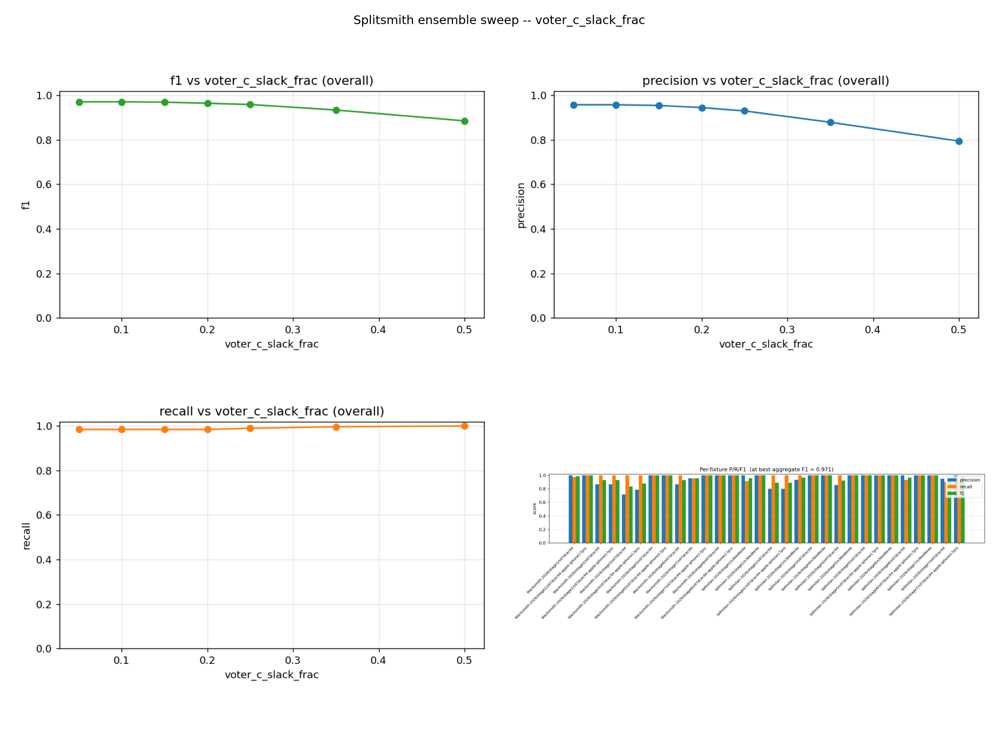

# Detection methodology

Splitsmith treats *consistency across stages and matches* as more important than matching any other tool's exact timestamps. This document covers what the detector does, why, and how its output relates to a hardware shot timer like the CED7000.

## Beep detection (`beep_detect.py`)

1. Bandpass-filter the audio to `[freq_min_hz, freq_max_hz]` (default 2-5 kHz). Hilbert envelope, smoothed at 40 ms (broad enough to bridge the natural intra-beep dips IPSC tones produce). A separate 10 ms-smoothed envelope is held for rise-foot timing so the smoothing bias doesn't shift the leading edge.
2. **Adaptive cutoff**: a candidate run must clear `max(min_amplitude * peak, noise_floor * noise_factor, min_abs_peak)`. The noise-floor leg recovers handheld / phone clips where the beep is faint in absolute terms but still well above the recording's median noise floor.
3. **Learned ranking** (#949): every run gets seven timer-agnostic features (silence preference, tonal ratio, duration, prominence over the noise floor, loudness relative to the window, spectral flatness and spectral prominence). A logistic regression fitted on the labelled corpus ranks them; leave-one-match-out it picks the beep on 106 of 127 fixtures, against 65 for the earlier hand-written `tanh(silence) * tonal * duration` product (still available as `ranker: heuristic`).
4. **Adaptive rise-foot leading edge**: walk back from the run's peak while the envelope stays above `max(peak * 5%, noise_floor * 1.5x)`. The noise-floor floor stops the walk from sliding into pre-beep silence on faint beeps where 5 % of the peak is below the floor.
5. **Calibrated confidence in [0, 1]** per candidate -- a head over the candidate's ranker logit and its margin to the best other candidate, fitted on out-of-fold predictions. Out of fold (each match scored by a model that never saw it), 69 of 127 fixtures clear 0.97 under the shipped head and none of them is wrong (`tests/fixtures/beep_calibration/ranker_report.json`, `final_head_bins`). On the corpus it was fitted on, 75 clear and one is wrong: a fixture whose beep is never a candidate, picked 108 ms early. Field audio is out of sample, so the out-of-fold figure is the estimate that applies. The production UI / MCP use this to gate the **auto-trust** chain (`automation.beep_low_confidence_threshold`, default 0.97); below the threshold the beep lands in the HITL queue.

Calibration evidence + per-confidence-bin precision live under `tests/fixtures/beep_calibration/baseline.json`; rebuild via `scripts/build_beep_calibration.py` after adding new audited fixtures and re-run `scripts/eval_beep_detector.py` to refresh the table.

### Auto-trust + HITL queue (issue #219)

A detected beep with `confidence >= automation.beep_low_confidence_threshold` (default 0.97 since the learned ranker, #949; 0.95 from #296, 0.6 before) flips `beep_reviewed=True` automatically -- the downstream chain (auto-trim, auto-shot-detect-on-beep-verified) fires without a manual review click. Below the threshold the beep stays unreviewed and shows up in the **HITL queue**:

- HTTP: `GET /api/hitl-queue` returns `{items: [...], threshold: float}`.
- SPA: the **Needs review** card on the Ingest page polls the queue and surfaces each item's `suggested_action` text + a one-click "Open" button that scrolls to the relevant stage row.
- MCP: `get_hitl_queue` exposes the same shape; an agent (or `/splitsmith-match`) drives the picks via `select_beep_candidate` / `set_beep_manual` / `mark_beep_reviewed`.

Tune the threshold via `~/.splitsmith/config.yaml`:

```yaml
automation:
  beep_low_confidence_threshold: 0.97  # auto-trust >= this; below is HITL (0.97 is the default)
  shot_detect_on_beep_verified: true   # the existing chain gate
```

Per-project overrides + the resolved provenance badge (CLI > project > global > default) ride on the same automation block.

## Shot detection (`shot_detect.py`)

1. **Skip the first 500 ms after the beep.** Beep tones are 200-400 ms and human reaction + draw is never under 500 ms on a head-mounted recording.
2. **`librosa.onset.onset_detect`** with spectral flux (default `delta=0.07`, `pre_max=post_max=30 ms`) finds onset frames at ~10.7 ms resolution.
3. **80 ms minimum-gap filter** (greedy): drop onsets within 80 ms of a previously-kept one. Catches close echoes from steel/walls.
4. **150 ms echo refractory**: drop subsequent onsets within 150 ms of a kept onset whose peak amplitude is below 40% of the previous peak. Catches lower-amplitude intra-bay echoes.
5. **Rise-foot leading edge**: this is the per-shot time you see in outputs, defined below and computed by `splitsmith.rise_foot`.

### A shot's time: the rise foot

**Definition.** A shot's time is the foot of the rise that leads to the shot's own peak: walking back from that peak, the last moment the level is still above both 5 % of the peak and 1.5 x the noise floor just before the shot. An earlier sound separated from the burst by a dip (the level falls below a quarter of the peak and rises again behind it: an echo, the previous shot, a lead-in that falls back before the blast) is not part of the rise. A lead-in that ramps continuously into the burst is. Times are stored to the millisecond.

This is the leading edge the eye picks when scrubbing a zoomed waveform, and the same rule the beep detector uses for the beep (see above, step 4). It is measured against the shot's own peak, so it is **insensitive** to camera AGC ducking, recording gain and distance (the foot sits at the same point of a quieter shot's rise), and the noise floor keeps it from sliding into the noise before the shot on loud backgrounds.

**One rule, three places,** held identical by `tests/fixtures/rise_foot/cases.json` (run by `tests/test_rise_foot.py` and the app's `lib/peak-snap.test.ts`):
- the shot detector's leading edge (`shot_detect`; still the older walk until the switch in the follow-up to #1363 lands, see History),
- the app's drop snap in Audit and the fixture review while zoomed out (`lib/peak-snap.ts`; zoomed in to 2 ms per pixel or finer, a marker lands exactly where it is dropped),
- the review inventory's suggested corrections (`lab.inventory`).

A change to the definition changes all three and the cases file in the same PR.

**History.** Shot times were first the half-rise (the first sample at half the local peak); that lands mid-rise, visibly later than the audible start, and people dragging markers consistently pulled them earlier, so the detector moved to the rise foot (5 % of the peak, walking back from the peak found near librosa's frame). That walk had no noise floor and stopped at the first dip, so it ran into the noise before some shots (Vanguard: 8 to 15 ms early) and stopped inside compressed bursts (GO 3S: 20 to 30 ms late, 27 % of reviewed shots); see `docs/cameras.md`, 2026-10-10. The definition above, from the beep detector plus the dip rule, fixes both: read by eye on 118 sampled shots (blind, from plots without any marks), the detector's current times sit a median 4.4 / 8.2 / 7.2 ms from the main burst's start (GO 3S / Vanguard / handheld) and the definition 0.6 / 3.5 / 2.6 ms (issue #1363).

### Comparing splitsmith times to a CED7000 / Pact / similar

**Don't expect absolute timestamps to match.** A CED7000 typically uses an absolute amplitude threshold; splitsmith uses the rise foot, which sits at the very start of the rise. On the same recording the two can differ by 5-15 ms per shot, splitsmith earlier.

**Splits *do* match across recordings.** Because the definition is the same for every shot, the *difference* between two consecutive shot times is comparable across stages, matches and recording conditions; a constant per-shot offset cancels in the subtraction. This is the metric that matters, and why a rule that lands at different points of different shots (as the old walk did on GO 3S) is worse than one that is consistently early or late.

## Confidence ranking

Each shot has a `confidence` score = geometric mean of normalized onset strength and normalized peak amplitude (each normalized to the max within the kept set). Sorting CSV rows by confidence ascending puts the most likely false positives (echoes, neighbouring bays) at the top -- fast triage when culling.

Real shots that come right after a long pause are AGC-ducked and rank lower in confidence, so don't blindly delete the bottom-N rows. Eyeball timestamps too.

## Ensemble performance dashboard

The 3-voter shot-detection ensemble is parameterised on a handful of knobs (consensus level, per-voter thresholds, apriori boost, Voter C slack, ...). Sweep them over the audited fixture set and render plots + a detailed report:

```bash
# 1. Build the per-candidate signal table (slow; redo after corpus or
#    feature changes). Without --skip-voter-e it also pulls the CLIP
#    visual probe scores for fixtures whose source video is reachable.
uv run python scripts/build_sweep_signals.py --skip-voter-e

# 2. Replay the voters over a parameter grid (fast; pure numpy).
uv run python scripts/run_sweep.py \
    --grid scripts/sweep_grids/consensus_x_apriori.yaml

# 3. Render plots + a markdown report under build/sweeps/<run_id>/.
uv run python scripts/plot_sweep.py
```

The latest sweep's overview PNG lands at `build/sweeps/latest_overview.png` and its detailed report at `build/sweeps/latest_report.md` (with per-fixture P/R/F1 tables and the full parameter dump). Pre-built grids live in `scripts/sweep_grids/`; the full key vocabulary is documented in `scripts/run_sweep.py`. Two parquet files back the dashboard:

- `build/sweeps/signals.parquet` -- one row per (fixture, candidate) with every raw voter signal + ground-truth label. Invariant under threshold sweeps.
- `build/sweeps/runs.parquet` -- one row per (run_id, parameter combo, fixture) with precision / recall / F1, per-voter solo-correct counts, and effective thresholds.

Latest snapshot:



(See [`ensemble_dashboard/latest_report.md`](ensemble_dashboard/latest_report.md) for the full per-fixture breakdown + parameter dump that produced it.)

The natural next step for a live dashboard is extending the existing **Algorithm Lab** page (`splitsmith ui --lab`) to read `runs.parquet` directly -- it already owns the fixture-eval + live-tuning surface. Standing up a separate Streamlit / marimo app would duplicate that infrastructure.
