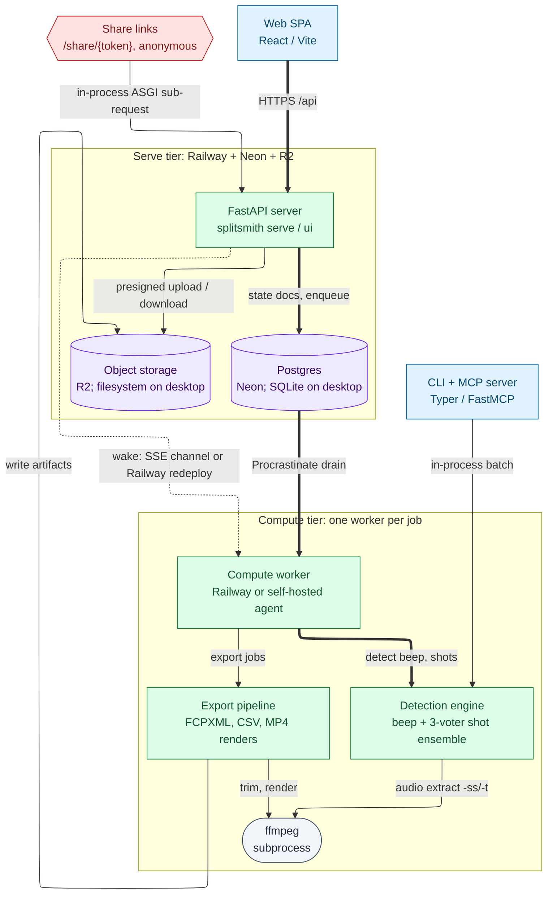
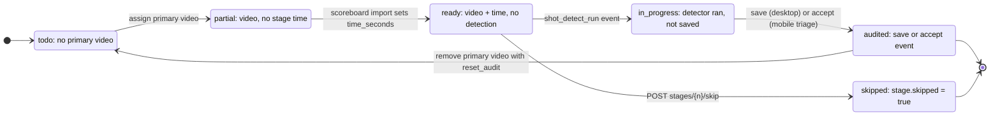
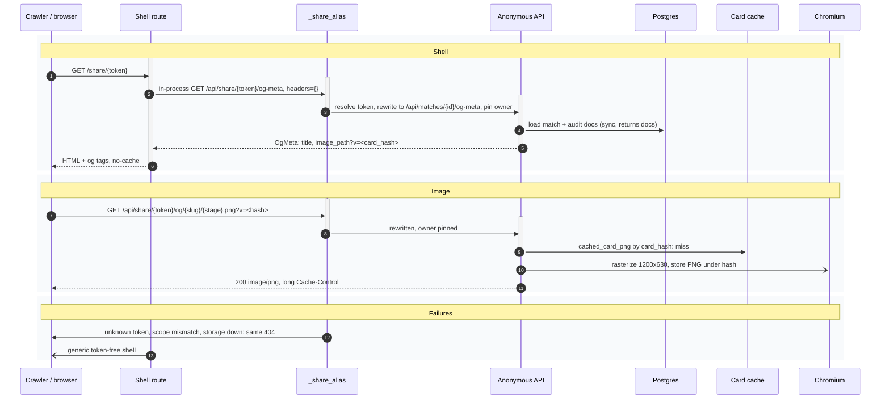

# Diagrams (GitHub-rendered)

Generated by `scripts/gen_mermaid_diagrams.py` from the Archify specs in this
directory; do not edit by hand. Each section links to the interactive HTML
version, which adds pan/zoom, search, guided views, swim lanes and source links.

## Splitsmith system architecture

Interactive: [`splitsmith.html`](splitsmith.html) (source: `splitsmith.architecture.json`)

**Entry points**

- SPA calls FastAPI only; uploads go to storage via presigned URLs
- CLI and MCP tools run the same engine modules in-process
- Share links resolve the token once, in _share_alias, then re-enter the anonymous API

**Jobs**

- Postgres is the queue (Procrastinate); no separate broker
- Dispatcher wakes the cheapest tier first: self-hosted agent over SSE, Railway redeploy as fallback
- Desktop mode runs the same server on SQLite + filesystem with jobs in-process

**Pipeline**

- beep_windows -> beep_detect -> trim -> shot ensemble; pure functions over audio + config
- Voters: envelope onsets, CLAP similarity, GBDT over features + PANN; 2-of-3 consensus; shipped as ONNX under src/splitsmith/data
- Outputs: per-stage CSV, FCPXML and report; per-match FCPXML, MP4 overlay, compare grid, share cards

## Stage status lifecycle

Interactive: [`stage-status.html`](stage-status.html) (source: `stage-status.lifecycle.json`)

**Derived, not stored**

- One classifier feeds sidebar, Home, Shooters, chips
- Hosted: audit docs from state_docs; desktop: the file

**Exits**

- skipped is checked first; skip again restores status
- Only removing the primary with reset_audit resets

## Per-stage detection job chain

Interactive: [`stage-detection.html`](stage-detection.html) (source: `stage-detection.workflow.json`)

```mermaid
%%{init: {"flowchart": {"defaultRenderer": "elk"}}}%%
flowchart LR
    attach["Attach video<br>covers_stages -> N videos"]
    windows["beep_windows<br>scoreboard or sequential"]
    beep["beep_detect job<br>ffmpeg -ss/-t in window"]
    softfail["Soft fail<br>beep_auto_detect_failed"]
    gate{{"Confidence gate<br>confidence >= threshold"}}
    hitl{{"HITL queue<br>pick candidate, review"}}
    trimcache[("Trim cache<br>stageN_slug_trimmed.mp4")]
    trim["trim job<br>short GOP, audio copied"]
    shots["shot_detect job<br>3-voter ensemble, 2-of-3"]
    auditdoc[("Audit JSON<br>shots[], audit_events")]
    audit["Audit page<br>review markers, save"]
    attach -->|"enqueue beep_detect"| beep
    beep -.->|"derive search window"| windows
    beep -->|"calibrated confidence"| gate
    gate ==>|"auto-trust: beep_reviewed"| trim
    gate -->|"below threshold"| hitl
    hitl -->|"mark reviewed"| trim
    beep -->|"no candidate in window"| softfail
    trim -.-> trimcache
    trim ==>|"shot_detect_on_beep_verified"| shots
    shots -->|"stage -> in_progress"| audit
    shots -.->|"shots[] + shot_detect_run"| auditdoc
    audit -.->|"save event -> audited"| auditdoc
    classDef frontend fill:#e0f2fe,stroke:#0369a1,color:#0c4a6e
    classDef backend fill:#dcfce7,stroke:#15803d,color:#14532d
    classDef database fill:#ede9fe,stroke:#6d28d9,color:#3b0764
    classDef security fill:#fee2e2,stroke:#b91c1c,color:#7f1d1d
    classDef messagebus fill:#ffedd5,stroke:#c2410c,color:#7c2d12
    classDef cloud fill:#f1f5f9,stroke:#475569,color:#1e293b
    classDef external fill:#f1f5f9,stroke:#475569,color:#1e293b
    class attach,audit frontend
    class beep,trim,shots,windows backend
    class gate,hitl security
    class softfail messagebus
    class trimcache,auditdoc database
```

**Gates**

- Below 0.95 the beep waits in GET hitl-queue; above, beep_reviewed is pre-set
- shot_detect_on_beep_verified chains trim -> shots; CLI and agents can turn it off

**Windows**

- Scoreboard mode anchors on scorecard_updated_at; else the previous beep chains
- A windowed miss soft-fails so the next covered stage still runs

## Share link preview request

Interactive: [`share-link.html`](share-link.html) (source: `share-link.sequence.json`)

**One impersonation**

- Token resolution and owner pinning live once, in _share_alias
- Sub-requests carry no headers; the surface is anonymous

**Freshness by address**

- ?v=<card_hash>: a re-audit moves the hash, so crawlers refetch
- Every failure is the same 404 or generic shell: no token oracle

## Hosted data model

See [`data-model.md`](data-model.md), generated from `db/models.py`.
