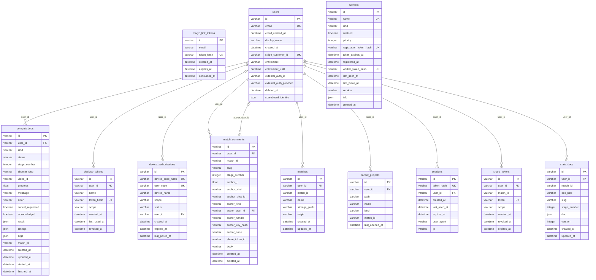
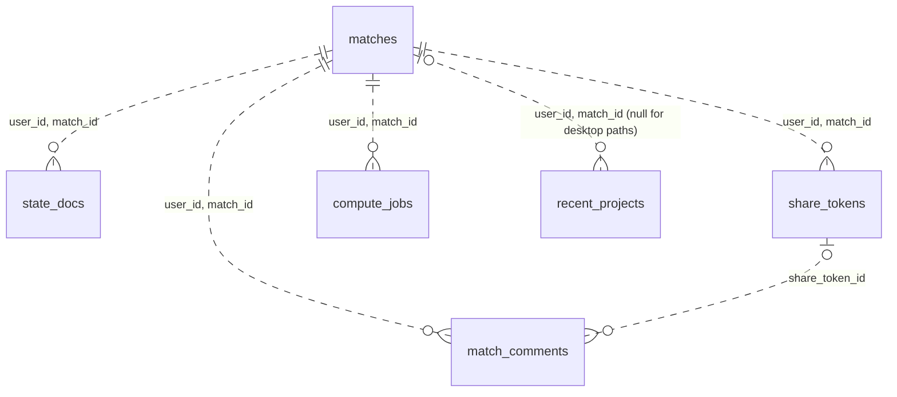

# Hosted data model

The twelve tables behind hosted mode (`SPLITSMITH_MODE=hosted`), as declared
in `src/splitsmith/db/models.py`. Tests and the local hosted variant run the
same schema on SQLite; desktop `splitsmith ui` keeps its state on disk under
`~/.splitsmith/` and does not touch these tables.
The entity blocks below are generated from the SQLAlchemy metadata by
`scripts/gen_er_diagram.py`; the notes after them are written by hand.

<!-- BEGIN GENERATED: scripts/gen_er_diagram.py -->

<!-- END GENERATED -->

## What the foreign keys do not say

Only `user_id` is a database-level foreign key. The other joins are logical
and keyed on `(user_id, match_id)`:

- `matches` is unique on `(user_id, match_id)`; `match_id` alone is the
  scoreboard/registry id and repeats across users.
- `state_docs` holds every per-match JSON document, discriminated by
  `doc_kind` (`match`, `project`, `audit`, `export_runs`, ...) plus `slug`
  and `stage_number` for per-shooter and per-stage kinds. Adding a
  `doc_kind` is not a local change: see "State doc kinds and the sync
  allowlist" in `CLAUDE.md` before adding one.
- The delete cascades are hand-written queries, not `ON DELETE`:
  `delete_match` filters on `match_id` alone and `delete_shooter` on
  `(match_id, slug)`, so both sweep new per-shooter kinds without edits.
- `match_comments.author_handle` is server-derived; the request model has
  no field for it. `author_user_id` is set for signed-in commenters.
  `author_key_hash` is a client-minted key so an anonymous commenter can
  delete their own comment; it is convenience, not a security boundary.
  `share_token_id` is the moderation primitive: every comment that came
  through one link is one query.
- `workers` has no `user_id`: compute targets belong to the deployment, not
  a tenant. The `kind='railway'` row is seeded from env vars; self-hosted
  agents register through `POST /api/workers/register`.
- Column types are shown as SQLAlchemy reports them (`varchar`, `json`,
  `datetime`). `state_docs.doc` is JSONB on Postgres (generic JSON
  elsewhere so SQLite tests work); the other `json` columns are read and
  written whole and stay generic JSON on every backend.

Regenerate with `uv run --frozen python scripts/gen_er_diagram.py`; pass
`--check` to verify the block is current.
