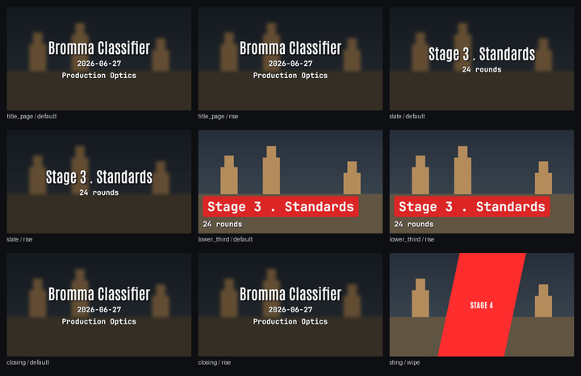
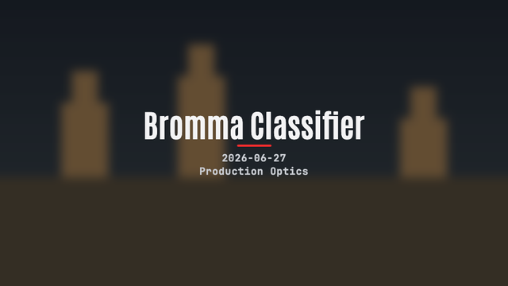
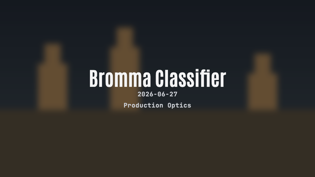
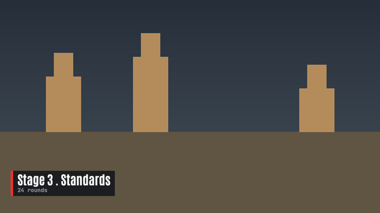
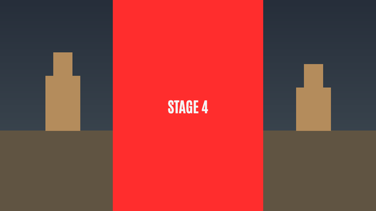

# Making a Look

A Look decides how a rendered video's generated cards look: the title page,
the stage slates, the lower third, the closing card and the stings between
stages. It is a folder with a `look.json` (colours and which template draws
which card) and HTML templates. This guide takes you from a copy of the
default Look to your own templates.



## Contents

- [Make one](#make-one)
- [look.json](#lookjson)
- [Templates](#templates)
- [Animation](#animation)
- [Lower third](#lower-third)
- [Stings](#stings)
- [Logos and identity](#logos-and-identity)
- [Fonts](#fonts)
- [Checking](#checking)
- [Previewing](#previewing)
- [On splitsmith.app](#on-splitsmithapp)

## Make one

```sh
splitsmith looks new club-red --from splitsmith   # a copy of a Look, every file but its previews
splitsmith looks new club-red --starter still     # or a minimal Look around one starter
splitsmith looks check club-red                   # validate it
splitsmith looks preview club-red                 # render every card to PNGs
splitsmith looks list                             # what is installed
```

Your Looks live in `~/.splitsmith/looks/<name>/`. A folder there with the
same name as a shipped Look replaces it. Pick a Look on the Export page, or
with `--theme <name>` on `match export` and `--overlay-theme <name>` on
`compare export`.

Four starters ship, each a short commented template:

| Starter | What it is |
|---|---|
| `still` | A still card for the title page, slates and closing card |
| `animated` | The same card, its lines rising into place |
| `lower-third` | A band over the first seconds of a stage |
| `sting` | A band swept across the cut between stages |

## look.json

```json
{
  "name": "club-red",
  "label": "Club red",
  "colors": { "ink": [244, 244, 245], "accent": [255, 45, 45], "...": "..." },
  "accent_series": ["#ff2d2d", "#fbbf24", "#4ade80"],
  "slots": {
    "title_page": { "default": "card.html", "rise": "card-rise.html" },
    "slate": "card.html",
    "transition": { "wipe": "sting-wipe.html" }
  }
}
```

- `name` matches the folder: lower-case letters, digits, `-` and `_`.
- `colors` are RGB triples. Every one of these is required:

  | Token | Where it shows |
  |---|---|
  | `ink` | Names, figures, the main card text |
  | `ink_2` | Secondary lines: the date, the division |
  | `muted` | Labels such as SCORING and SPLITS |
  | `subtle` | Faint helper text |
  | `surface` | The card backdrop when there is no frame |
  | `rule` | Hairlines between bands |
  | `stroke` | The outline behind text on footage |
  | `accent` | The brand colour: rules, the sting band |
  | `accent_fill` | Filled badges (DQ) |
  | `accent_text` | Text on an accent fill |
  | `split` | The current split |
  | `split_good` | A fast split, Alphas |

  `split_slow` is optional. A template reads them as `#rrggbb` strings.
- `accent_series` colours shooters who have not set an accent of their own,
  by grid tile.
- `slots` names a template per card: `title_page`, `slate`, `lower_third`,
  `closing`, and `transition` for stings. A bare file name is the `default`
  style; a map names several styles, which become the Style choices on the
  Export page. A card your Look does not name is drawn by the shipped
  `splitsmith` Look's template in your colours.

## Templates

A template is an HTML page rendered in Chromium at the video's frame size.
It is drawn over the stage's blurred frame, so keep the page transparent.
Before your scripts run, `window.splitsmith` holds everything to draw:

```js
window.splitsmith = {
  theme:  { ink: "#f4f4f5", accent: "#ff2d2d", /* every colour token */ },
  size:   { width: 1920, height: 1080 },        // the frame, in CSS pixels
  fps:    30,
  engine: { css: "...", min_font_size: 12 },     // the font faces; the legibility floor
  assets: { shared: "file:///.../_shared" },     // fit.js, cell.js, identity.js
  data: {
    card: {
      slot: "title_page",                        // or slate, lower_third, closing
      variant: "default",
      text: "Bromma Classifier",                 // the match or the stage name
      info: ["2026-06-27", "Production Optics"], // the lines under it
      duration_seconds: 3
    },
    shooters: [{ label: "Mathias Axell", accent: "#ff2d2d", club: "Bromma PK", logo: "file:///.../logo.png" }],
    groups: [ /* the shipped template's own layout; yours may ignore it */ ]
  }
};
```



Size things from `size.height` so one template works at 720p and 4K. Start
from `--starter still`; it puts in the engine stylesheet for the fonts:

```html
<script>document.write('<style>' + window.splitsmith.engine.css + '</style>');</script>
```

**Long text.** Stage and match names can be long. Define
`window.__splitsmithFit`; the renderer calls it once the fonts are ready and
before it takes the picture. The starters shrink the text until it fits.

**Avoid globals the browser already owns.** A top-level `var name` is
`window.name`, a string; `name.style` is then undefined.
`looks check` reports the error this causes.

## Animation



The renderer never plays a template in real time. It asks three questions
and steps through the answer frame by frame:

| Function | Answer |
|---|---|
| `duration()` | How many seconds the animation lasts; 0 or missing is a still card |
| `seek(t)` | Put every animation at `t` seconds, paused |
| `poster()` | The moment previews show; usually the end of the animation |

After the animation ends its last frame holds for the rest of the card.
Web Animations made pausable answer `seek` in a line each:

```js
var a = el.animate([{ opacity: 0 }, { opacity: 1 }], { duration: 500, fill: 'both' });
a.pause();
window.duration = function () { return 0.5; };
window.poster = function () { return 0.5; };
window.seek = function (t) { a.currentTime = t * 1000; };
```

## Lower third



A lower third is drawn over the first seconds of a stage, so cover only a
corner and leave the rest transparent. `data.card.text` is the stage name and
`info` the round count. Animate the way in only; the renderer fades it out at
the end of the card.

## Stings



A sting is drawn over the crossfade between two stages for the whole
transition. Instead of `data.card` it gets:

```js
data.transition = { kind: "sting:wipe", name: "wipe", duration_seconds: 1, from: "Stage 3", to: "Stage 4" }
```

`duration()` must return `duration_seconds`: the renderer samples exactly
that long. Name the sting under `transition` in `look.json`, then choose it on
the Export page or with `--transition sting:<name>`.

## Logos and identity

`data.shooters` lists the shooters a card is about, each with their label,
accent, club line and logo, as `file://` URLs. The logo is the shooter's own,
or the match logo. The shipped cards draw the logos top right through
`_shared/identity.js`; a lower third shows one only when a single shooter has
one. Your template may draw them any way it likes, or not at all.

## Fonts

Two family names load: `Splitsmith Display` and `Splitsmith Mono`, declared
by `engine.css`. Draw with those names and your template follows whatever
faces the Look chooses. Any other family name falls back to a system font,
which differs between machines, and `looks check` warns about it.

`look.json`'s `fonts` picks a face per role (`display`, `mono`): a bundled one
by id (`antonio`, `bebas-neue`, `oswald`, `barlow-condensed`;
`jetbrains-mono`, `roboto-mono`, `ibm-plex-mono`) or, on the desktop, a font
file of the Look's own. Add one in the Look editor under Card styles, Fonts,
Add a font file: a TTF or OTF of up to 2 MB, which lands in the Look's
`fonts/` folder named by its content and is named in `look.json` as
`"own:font-<hash>.ttf"`. Both roles may use it; the clock in the overlay
draws with the `mono` face too. WOFF files and font collections are refused,
because ffmpeg draws the clock from the same file. The font's licence is
yours to hold: use one you may use in published video.

## Checking

`splitsmith looks check <name>` loads every template your Look owns in
Chromium against three sample cards: one shooter with a logo, two shooters
without, and a 52-character stage name. Stings get the transition instead.

```text
Look club-red  ~/.splitsmith/looks/club-red  user
  look.json                       ok     13 colours, 6 in the accent series
  title_page rise card-rise.html  error  script error: ... (sample: two shooters, no logo)
  lower_third default card.html   warn   "Stage 7 - The Very Long ..." runs past the card by 38 px
  transition wipe sting-wipe.html ok     1 s, poster at 0.5 s, 3 sample cases
1 error, 1 warning
```

| Finding | What to do |
|---|---|
| `script error` | The template threw; the card would be skipped in a render |
| `has no seek()` | It animates but every frame would be the same; add `seek` |
| `poster() ... outside duration()` | Previews would show a frame the video never reaches |
| `names <family>` | Use `Splitsmith Display` or `Splitsmith Mono` |
| `runs past the card` | Shrink long text in `__splitsmithFit`, or ellipsize it |
| `look.json: ...` | The manifest does not load; the message names the field |

The exit code is 1 when there is an error, so it fits in a script, and 2
when it could not run at all (no Chromium). `new` and `preview` exit 2 on a
request they refuse, such as a name that is taken or a broken `look.json`.

## Previewing

`splitsmith looks preview <name>` renders every card style and sting the Look
draws to `./<name>-preview/`: one PNG each and `contact-sheet.png`. Add
`--project <shooter project folder> --stage <n>` to draw them over that
stage's own frame, with that shooter's identity.
A card whose template fails is left out of the preview with a line naming
it; `looks check` says why.

## On splitsmith.app

A template is code, and on splitsmith.app it would run on our servers. Until
templates there run in a sandbox that keeps them away from the server's files
and the network, a Look on splitsmith.app holds colours and card styles only,
drawn by the shipped templates. Write templates in the desktop app or the
`splitsmith` command line.
